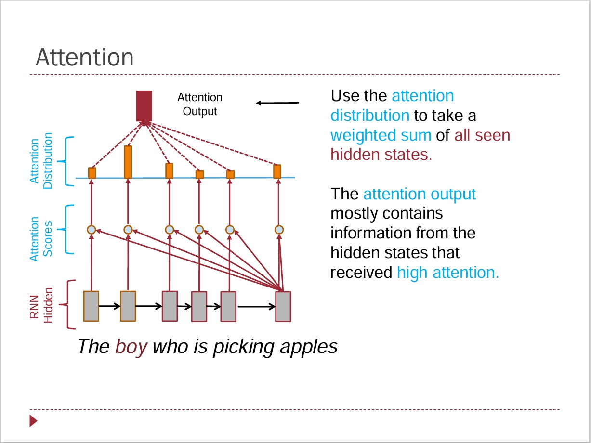
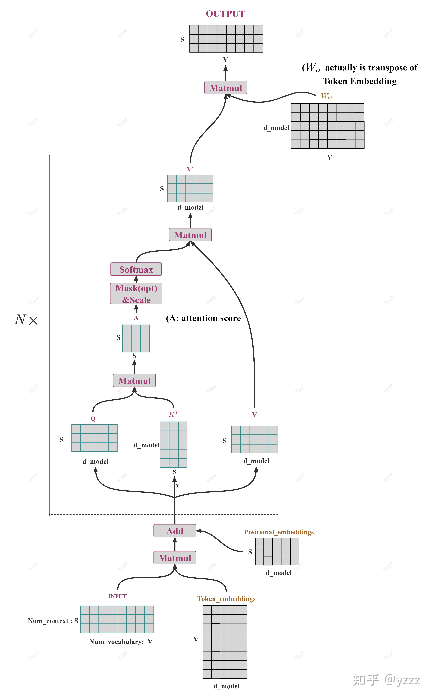
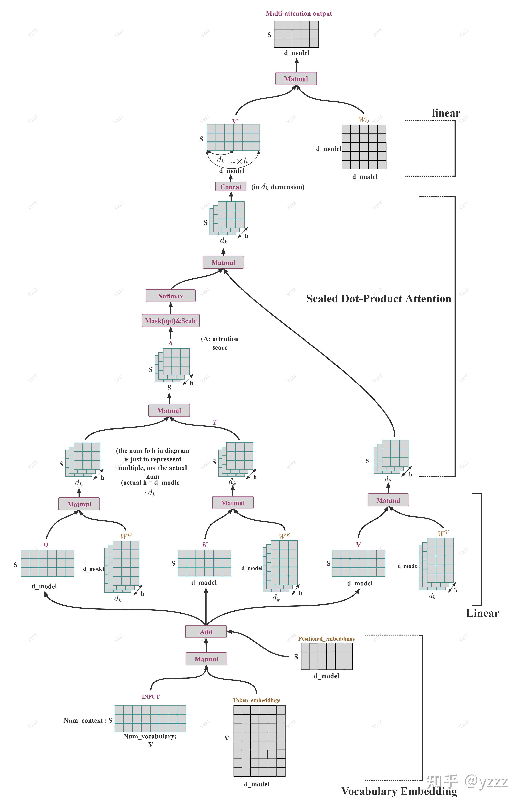

# 初步理解 Attention 机制

这一节准备集中回答下面这些问题：

1. Attention 的直觉到底是什么？
2. Q、K、V 分别在表示什么？
3. Self-Attention 里的 self 是什么意思？
4. Attention 的矩阵形式到底是怎么写出来的？
5. Attention Mask 在做什么？为什么 GPT 和 BERT 的处理不一样？
6. Attention 里有哪些训练和实现细节？为什么它的复杂度又这么值得关注？
7. Multi-Head Attention 为什么不是简单重复，而是真的有意义？

## Q1: Attention 的直觉是什么？数学期望

\\[
\mathrm{Attention}(q, X) = \sum_{i=1}^{n}\alpha_i x_i,\quad
\alpha_i = \frac{\exp(s(q, x_i))}{\sum_{j=1}^{n}\exp(s(q, x_j))}
\\]

其中：

- \\( X = [x_1, x_2, \dots, x_n] \\) 表示一个序列里的向量表示；
- \\( x_i \\) 表示序列中第 \\( i \\) 个位置对应的向量；
- \\( q \\) 表示当前位置拿来和整个序列做匹配的查询向量；
- \\( s(q, x_i) \\) 表示相似度分数，最常见的情况就是点积；
- \\( \alpha_i \\) 表示归一化之后的权重。

如果把 \\( \alpha_i \\) 看成一个概率，那么 attention 的输出也可以写成：

\\[
\mathrm{Attention}(q, X) = \mathbb{E}_{ X \sim \alpha | q}[\mathbf{X}]
\\]

也就是说，attention 最后得到的其实是一个在权重分布下的加权平均，也可以理解成一个condition on q 的条件“期望”。



> 图示来源：Shanghaitech CS 274A, Natural Language Processing, Kewei Tu.

如果从刚才我们前一节提到的 NLP 发展脉络来看，attention 的核心想法其实非常直接，也非常自然。毕竟Self-Attention最初于2014年就被提出时要解决的问题本身也很明确。

放到当时的背景里，attention 是在 sequence to sequence 的问题下提出来的。当时主干模型还是 RNN。简单来说，当时模型面对的是这样一个问题：

- 输入是一个 embedding sequence；
- 输出通常还是一个 embedding sequence；
- 每个词先会被表示成 embedding；
- 但我现在希望得到的，不只是当前位置自己的 embedding，而是“当前位置和整个序列之间关系”之后形成的一个新表示。

也就是说，attention 最初要解决的问题可以理解成：

我当前这个位置的表示，和整个句子里的所有位置到底是什么关系？我希望得到的这个新表示，能够反映“当前这个词和整个句子之间的关系”。

所以它本质上做了两件事。

第一部分是强调“相关性”。

我想知道，我当前这个词的表示，和序列里其他位置的表示，哪个更相关。最自然的数学操作就是内积，也就是点积。因为点积本来就是一个很常见的相似性度量。将向量的相关性转化为一个标量.

第二部分是把这些相关性分数变成真正可用的权重。

因为最后 attention 还是要输出一个新的向量表示，所以我需要把“相关性分数”变成“权重”，然后对整个序列的信息做加权求和。这里最自然的做法就是 softmax。softmax 会把这些分数归一化成一组非负、和为 1 的权重。这样一来，这组权重就既可以理解成概率，也方便后面做加权平均。

所以从这个角度看，attention 可以很自然地被类比成一个数学期望。

我先根据相关性构造出一个分布，再在这个分布下，对整个序列里的表示做加权平均。这个理解我自己现在会觉得特别顺，因为它既符合直觉，也符合数学表达。

所以这一块如果只保留最核心的一句话，我会更倾向于这么说：

attention 的本质，就是先计算“当前位置应该关注谁”，再把整个序列的信息按这个关注分布做加权平均，得到当前位置新的表示。

## Q2: Q、K、V 分别表示什么？

从这个角度理解 attention 之后，QKV 其实就会比一开始好理解很多。

我之前看很多材料的时候，Q、K、V 这三个字母会越看越晕。后来我慢慢感觉，问题不在于这三个符号本身有多难，而在于如果前面没有先把 attention 理解成“相关性 + 概率分布 + 期望”。

如果沿着刚才的思路往下看，Q、K、V 其实只是把 attention 里不同功能拆开命名了。

严格说，完全可以直接拿原始的 embedding 去做这件事：我用当前位置的向量和整个序列里的向量做相似性计算，再对整个序列做加权平均。这在概念上是完全说得通的。

但是在深度学习里，通常不会直接这样做，而是会再经过一层可学习的线性变换，把不同功能交给模型自己去学。也就是说：

- 哪个表示更适合拿来做匹配；
- 哪个表示更适合拿来被聚合；
- 哪个表示更适合描述“我现在想找什么”。

这些都交给模型自己学。

所以就有了这三个记号：

- Query，记作 \\( Q \\)
- Key，记作 \\( K \\)
- Value，记作 \\( V \\)

如果按我现在的理解方式来讲：

- Query 可以理解成“当前位置拿什么去问”；
- Key 可以理解成“序列中每个位置拿什么去响应这个问题”；
- Value 则是“这个位置真正携带、最后要被加权聚合的内容”。

换句话说，Q 和 K 的作用主要是构造相关性，或者说构造匹配分数。V 的作用则是：在这个分数对应的概率分布下面，提供最后被求期望、被加权平均的对象。

所以从这个角度看，QKV 不是三个孤立的神秘符号，而是 attention 里三个不同的功能角色。

如果再贴着“期望”这个理解去说，会更顺一些：

- Q、K 负责定义一个分布；
- V 负责定义这个分布下要聚合的随机变量取值。

这样一来，为什么最后是“先算 QK 的相关性，再去加权 V”，就会自然很多。

当然，在教材或者资料里，最常见的直觉表达还是：

- Query：当前位置“想找什么”
- Key：每个位置“能提供什么索引”
- Value：每个位置“真正携带的内容”

这个说法本身没有问题，而且很常用。只是对我自己来说，如果把它和“相关性 + 概率分布 + 数学期望”这条线连起来，QKV 会清楚很多。

这也解释了为什么像 RoPE 这样的位置信息，通常作用在 \\( Q/K \\) 上，而不是直接作用在 \\( V \\) 上。因为位置关系首先影响的是“怎么匹配”，而不是“内容本身是什么”。

## Q3: Self-Attention 里的 self 是什么意思？

Self-Attention 里的 self，意思是：

- Query、Key、Value 都来自同一个输入序列。

也就是说，整个 attention 是作用在“这个序列对自己”的关系上的。

换句话说，你输入的是一个序列，最后输出的也还是一个序列。只不过输出序列里每个位置对应的表示，已经不再只是它自己原来的 embedding，而是“当前位置和整个序列发生关系之后”的一个新表示。

这个理解我觉得很重要，因为它其实就是后面 score、attention map 这些东西的基础。

如果把这个过程写成最简单的 tensor shape 伪代码，可以先这么看：

```text
seq_in  : [batch_size, seq_len, embedding_dim]
seq_out : [batch_size, seq_len, embedding_dim]
seq_out = attention(seq_in)
```

这里最关键的是：

- 输入是一个序列；
- 输出还是一个序列；
- 但每个位置的输出，都已经带上了它和整个序列之间的关系。

如果把输入序列记成：

\\[
X \in \mathbb{R}^{n \times d}
\\]

其中：

- \\( n \\) 表示序列长度；
- \\( d \\) 表示 hidden dimension。

那么通常会先通过三个线性变换得到：

\\[
Q = XW_Q,\quad K = XW_K,\quad V = XW_V
\\]

其中：

- \\( W_Q, W_K, W_V \\) 是可学习参数矩阵。

因为它们都来自同一个输入 \\( X \\)，所以这叫 self-attention。

所以 self-attention 这一层可以理解成：把一个序列，变成另一个同长度的序列；但新序列中每个位置的表示，都已经融合了它对整个序列的关注关系。

## Q4: Attention 的矩阵形式到底是怎么写出来的？

前面如果是按“一个位置去关注整个序列”来理解的，那么到矩阵形式时，本质上只是把这个过程一次性并行算完。

先把输入序列记作：

\\[
X \in \mathbb{R}^{n \times d}
\\]

其中：

- \\( n \\) 表示 sequence length；
- \\( d \\) 表示 hidden size。

**这里有一个细节很值得先说清楚**：在这套写法里，\\( X \\) 的feature 维度是行向量.这个记号和很多线性代数教材里“列向量是feature”的写法不完全一样，但在深度学习实现里这样写会更自然，因为 tensor 的 shape 通常就是 `[..., seq_len, hidden_dim]`。相当于在这个矩阵前面拼接batch维度,所以 feature 维度在后面。如果按照列向量的写法，反而会让后面矩阵乘法的 shape 对不上.

数学表达是 \\( x_i \in \mathbb{R}^d \\) 列向量表示feature. 
feature做列向量的feature矩阵为:

$$
    X = [x_1, x_2, \dots, x_n] \in \mathbb{R}^{d \times n}
$$
如果按照行向量的写法，\\( x_i \in \mathbb{R}^d \\) 作为行向量表示feature.
$$
    X = (x_1^\top, x_2^\top, \dots, x_n^\top)^\top \in \mathbb{R}^{n \times d}
$$
<!-- 或者更标准的写法:

\\[
\begin{aligned}
X =
\begin{bmatrix}
x_1^\top \\
x_2^\top \\
\vdots \\
x_n^\top
\end{bmatrix}
\in \mathbb{R}^{n \times d}.
\end{aligned}
\\]

$$
X =
\left[
\begin{matrix}
x_1^\top \\
x_2^\top \\
\vdots \\
x_n^\top
\end{matrix}
\right]
\in \mathbb{R}^{n \times d}.
$$ -->


Q,K,V是X经过三个线性投影变换得到的：

\\[
Q = XW_Q,\quad K = XW_K,\quad V = XW_V
\\]

其中：

- \\( W_Q \in \mathbb{R}^{d \times d_k} \\)
- \\( W_K \in \mathbb{R}^{d \times d_k} \\)
- \\( W_V \in \mathbb{R}^{d \times d_v} \\)

于是得到：

- \\( Q \in \mathbb{R}^{n \times d_k} \\)
- \\( K \in \mathbb{R}^{n \times d_k} \\)
- \\( V \in \mathbb{R}^{n \times d_v} \\)

接下来 attention 最经典的矩阵形式就是：

\\[
\mathrm{Attention}(Q, K, V) = \mathrm{softmax}\left(\frac{QK^\top}{\sqrt{d_k}}\right)V
\\]

> 注 : Attention 写成对每个\\(q^\top \in \mathbb{R}^{1 \times d_k} \\)的形式
\\[
\mathrm{Attention}(q, K, V) = \mathrm{softmax}\left(\frac{q^\top K^\top}{\sqrt{d_k}}\right)V
\\]

这个公式可以按顺序拆开看：

1. \\( QK^\top \\)：计算所有 query 和所有 key 的两两相似度，得到一个 \\( n \times n \\) 的分数矩阵；
2. 除以 \\( \sqrt{d_k} \\)：做缩放；
3. `softmax`：把每一行变成一个权重分布(**这个矩阵的每一行是一个分布,如果是q, softmax 后 shape 是 \\(1 \times n\\),依然是最后一个维度/行维度表示**)；
4. 再乘 \\( V \\)：按这个权重分布对整个序列的 value 做加权求和。(**输出的shape是 \\( n \times d_v \\)，n 表示序列,d_v 表示每个位置新的embedding维度**)

如果把 shape 一并写出来，会更直观：

\\[
QK^\top \in \mathbb{R}^{n \times n}
\\]

其中第 \\( t \\) 行第 \\( i \\) 列，表示“第 \\( t \\) 个位置对第 \\( i \\) 个位置”的关注分数。

然后：

\\[
A = \mathrm{softmax}\left(\frac{QK^\top}{\sqrt{d_k}}\right),\quad A \in \mathbb{R}^{n \times n}
\\]

最后：

\\[
Y = AV,\quad Y \in \mathbb{R}^{n \times d_v}
\\]

所以这一整套东西本质上就是：从一个 sequence 出发，先变成 Q/K/V，再变成 attention score matrix，最后再变成新的 sequence 表示。



> 图示来源：[图解 LLM 推理流程---Attention 算子 - ShawnYang - 知乎](https://zhuanlan.zhihu.com/p/4586600974)

在实际代码里，Q/K/V 的 shape 往往会写成：

```python
[bsz, num_heads, seq_len, head_dim]
```

这也是很多主流实现采用的形式。用这个 shape 时，`torch.matmul()` 会在最后两个维度上做矩阵乘法，而前面的 batch 和 head 维度自动对齐。

## Q5: Attention Mask 在做什么？为什么 GPT 和 BERT 的处理不一样？

前面那个公式其实还少写了一个在实现里非常关键的东西，就是 attention mask。

因为 attention 默认是“当前位置可以看整个序列”，但这件事在不同模型里并不总是成立。

如果是 BERT 这种双向编码器，它本来就允许一个位置同时看左边和右边，所以通常不需要 causal mask。它做的是“整个句子一起编码”，目标不是逐 token 地自回归生成。

但如果是 GPT 这种自回归语言模型，情况就不一样了。GPT 的训练目标是根据前文预测下一个 token，所以当前位置不能提前看到未来的位置，否则就相当于剧透了答案。

这时就需要一个下三角 mask。也就是说：

- 第 1 个位置只能看第 1 个位置；
- 第 2 个位置只能看前 2 个位置；
- 第 \\( t \\) 个位置只能看前 \\( t \\) 个位置。

如果把它写进公式里，通常会变成：

\\[
\mathrm{Attention}(Q, K, V) =
\mathrm{softmax}\left(\frac{QK^\top + M}{\sqrt{d_k}}\right)V
\\]

其中：

- \\( M \in \mathbb{R}^{n \times n} \\) 表示 mask 矩阵；
- 允许关注的位置加上 0；
- 不允许关注的位置加上一个非常小的数，比如负无穷附近的数。
>具体来说
>    - 下三角（含对角线）= 0 → 允许看到过去和当前 token
>    - 上三角 = -inf → 不允许看到未来 token

这样一来，softmax 之后，被 mask 掉的位置权重就会接近 0。

所以 attention mask 本质上并不是在“改变 attention 的定义”，而是在约束“哪些位置允许参与注意力分布”。

## Q6: Attention 里有哪些训练和实现细节？为什么它的复杂度又这么值得关注？

到了这一步，就会进入一些很典型的技术细节。

第一个就是为什么要有 scaled attention，也就是公式里那个 \\( \sqrt{d_k} \\)。

原因其实很直接。如果 \\( d_k \\) 很大，那么点积 \\( QK^\top \\) 的数值也会变得比较大。这样一来，softmax 很容易进入特别尖锐的区域，导致梯度变小，训练不稳定。

所以要除以 \\( \sqrt{d_k} \\) 来做缩放。这个缩放本质上是在控制数值范围，让 softmax 前面的分数不要过大，从而让训练更稳定。

第二个就是 attention 的计算复杂度。

Attention 最核心的计算量来自 \\( QK^\top \\) 这一步。

假设：

- \\( n \\) 表示序列长度；
- \\( d \\) 表示每个 head 的特征维度。

那么每个 query 都要和全部 \\( n \\) 个 key 做一次长度为 \\( d \\) 的点积，所以总复杂度可以粗略写成：

\\[
O(n^2 d)
\\]

这里最关键的不是公式本身，而是这个 \\( n^2 \\)。

也就是说，attention 的代价会随着序列长度平方级增长。序列一长，算力和显存压力都会上来。这也是为什么大家会在 attention 上花很多力气去做优化，因为它几乎就是整个 Transformer 里最“烧资源”的部分之一。

所以这一节如果只从直觉层面说，可以先记住：

- attention 非常强；
- 但 attention 很贵；
- 序列越长，它越贵；
- 后面很多工程优化，本质上都是围绕这里展开的。

## Q7: Multi-Head Attention 为什么不是简单重复，而是真的有意义？

Multi-Head Attention 的基本想法是：

不要只在一个表示子空间里做一次 attention，而是在多个子空间里并行地做 attention。

如果把 hidden size 记作 \\( d \\)，head 数记作 \\( h \\)，并且设每个 head 的维度是 \\( d_h = d / h \\)，那么第 \\( j \\) 个 head 可以写成：

\\[
\mathrm{head}_j =
\mathrm{Attention}(Q_j, K_j, V_j)
\\]

其中：

\\[
Q_j = XW_Q^{(j)},\quad K_j = XW_K^{(j)},\quad V_j = XW_V^{(j)}
\]

如果按单个 head 来看，这几组参数的 shape 通常是：

- \( W_Q^{(j)} \in \mathbb{R}^{d \times d_h} \)
- \( W_K^{(j)} \in \mathbb{R}^{d \times d_h} \)
- \( W_V^{(j)} \in \mathbb{R}^{d \times d_h} \)

也就是说，每个 head 都是把输入的 hidden size \( d \)，投影到一个更小的子空间 \( d_h \) 里，再在这个子空间里做 attention。

最后所有 head 的结果拼接起来，再乘一个输出投影矩阵：

\\[
\mathrm{MultiHead}(X) =
\mathrm{Concat}(\mathrm{head}_1, \dots, \mathrm{head}_h)W_O
\]

其中：

- \( \mathrm{Concat}(\mathrm{head}_1, \dots, \mathrm{head}_h) \in \mathbb{R}^{n \times (hd_h)} = \mathbb{R}^{n \times d} \)
- \( W_O \in \mathbb{R}^{d \times d} \)

所以从数学结构上看，multi-head attention 可以理解成：

- 先用多组 \( W_Q^{(j)}, W_K^{(j)}, W_V^{(j)} \) 把输入投影到多个不同子空间；
- 每个子空间各自做一次 attention；
- 再把这些结果拼接起来；
- 最后再用 \( W_O \) 投影回原来的 hidden size。

这里直观上可以理解成：

- 不同 head 关注的关系模式可能不一样；
- 有的 head 更关注局部邻近位置；
- 有的 head 更关注长距离依赖；
- 有的 head 更偏语法结构，有的更偏语义关联。

而且对我来说，multi-head 还有一个很重要的意义是：如果只有单头 attention，那么整个映射结构会显得比较单一。引入多个 head 之后，相当于先把输入投影到多个不同的子空间里，再分别做 attention，最后再融合回来。这样模型就有机会学习到更丰富的表示变化。

严格说，nonlinearity 主要还是来自 FFN、softmax 这些部分，但 multi-head 确实让 attention 这一层本身的表示能力更强了，不再只是“在一个单一空间里做一次线性风格很强的变换”。

如果从实际实现的角度看，代码里通常不会真的写成“for 循环一个 head 一个 head 地分别乘一次矩阵”。更常见的做法是，把多个 head 的投影参数先拼成一个大矩阵，一次性把所有 head 的 Q、K、V 都算出来。

比如在很多实现里，会直接用一个大的线性层得到：

\[
Q \in \mathbb{R}^{n \times (hd_h)},\quad
K \in \mathbb{R}^{n \times (hd_h)},\quad
V \in \mathbb{R}^{n \times (hd_h)}
\]

然后再通过 reshape / view，把它们整理成按 head 拆开的 tensor。常见的写法就是：

```python
[bsz, num_heads, seq_len, head_dim]
```

这样做的好处是，多个 head 的计算可以直接打包成一个 tensor 运算，让底层库一次性并行完成，而不是在 Python 层面做很多小矩阵乘法。也就是说，从数学定义上看，multi-head 像是很多个 head 分别算；但从工程实现上看，它通常会被组织成一次大的张量计算来加速。

最后再回到一个很自然的问题：为什么通常是拼接，而不是相加？

我现在更倾向于这样理解：

- 拼接能保留每个 head 独立学到的信息；
- 相加会过早把不同 head 的信息混在一起；
- 拼接之后再用一个线性层统一融合，表达能力更强，也更灵活。



> 图示来源：[图解 LLM 推理流程---Attention 算子 - ShawnYang - 知乎](https://zhuanlan.zhihu.com/p/4586600974)

## 这一节之后最重要的收获是什么？

如果只保留这一节最重要的几件事，我觉得是：

1. Attention 的核心是“动态地从上下文中检索和聚合信息”。
2. Q/K/V 不是孤立的三个字母，而是“匹配”和“取内容”这两个步骤的拆分。
3. Attention 可以理解成一个数学期望：先构造分布，再做加权平均。
4. Attention 的矩阵形式，本质上是在并行地计算“整个序列里每个位置对所有位置的关注关系”。
5. GPT 这类自回归模型必须用 mask，避免当前位置提前看到未来信息。
6. Attention 的 \\( O(n^2 d) \\) 复杂度解释了为什么它值得被重点优化。
7. Multi-Head Attention 的意义不只是重复算很多次，而是让模型在多个子空间里学习不同的关系模式。

下一节回到 MiniMind 项目本身，看看这些概念在实践中是怎么真正组织起来的。
